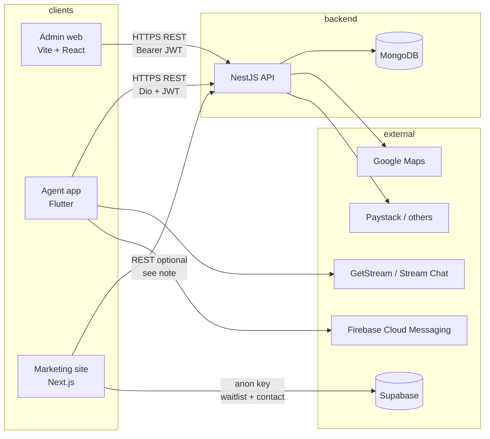

# Stayverse platform: how the apps connect and how to run them locally

This document describes how **stayverse-backend-main**, **stayverse-admin-main**, **stayverse-agent-app-master**, and **stayverse-website-main** relate to each other, what each depends on, and what you need on your machine to work end-to-end in development.

---

## 1. High-level architecture



### How they are linked (in this repo)

| Project | Role | Talks to |
|--------|------|----------|
| **stayverse-backend-main** | Single HTTP API (users, agents, apartments, rides, chefs, bookings, payments, notifications, metrics). | **MongoDB** (required). Optional/third-party: mail, maps, Paystack, Dojah, DigitalOcean storage, Stream, Firebase (push), Better Stack. |
| **stayverse-admin-main** | Super-admin UI. | Backend only: `axios` → `VITE_API_URL` (default `https://api.stayversepro.com/`). Login: `POST /users/login` with `expectedRole: 'admin'`. |
| **stayverse-agent-app-master** | Flutter agent app. | Backend: Dio `baseUrl` from `Constant.host` → `Env.hostDev` or `Env.hostprod` based on `mode` in `.env` (via **envied**). Also Stream Chat, Firebase, Sentry, Google Maps. |
| **stayverse-website-main** | Public marketing / landing (Next.js). | **Supabase** for `waitlist` and `contact` tables (`NEXT_PUBLIC_SUPABASE_*`). A `config/axios.ts` file exists with `http://localhost:3030` in dev but **is not imported anywhere**—the live site paths use Supabase, not the Nest API, unless you wire axios in later. |

---

## 2. Prerequisites (local machine)

Install and run as needed for the apps you care about:

| Requirement | Used by | Notes |
|-------------|---------|--------|
| **Node.js** (LTS, e.g. 20+) + npm | Backend, Admin, Website | Match versions close to each project’s `package.json`. |
| **MongoDB** | Backend | Local `mongodb://127.0.0.1:27017/...` or Atlas URI in `DATABASE_URL`. |
| **Flutter SDK** (^3.5 per `pubspec.yaml`) | Agent app | Plus Xcode (iOS) / Android Studio (Android). |
| **Supabase project** | Website | Create project; add tables `waitlist` (e.g. `email`) and `contact` (`email`, `message`); enable RLS policies as you prefer. |
| **Google Maps API key** | Admin (`VITE_GOOGLE_MAPS_API_KEY`), Agent (`GOOGLE_API_KEY` in `.env`), Backend (`GOOGLE_MAPS_API_KEY`) | Only where you use map features. |
| **Firebase** (optional locally) | Agent (`firebase_options.dart`), Backend push (`FIREBASE_KEY_FILE` or `GCP_KEY_FILE` JSON) | Backend can start without Firebase if initialization is skipped (see current `firebase.service.ts`). Agent still expects `Firebase.initializeApp` unless you change `main.dart`. |

---

## 3. Backend (`stayverse-backend-main`)

### What it needs to start

- **`DATABASE_URL`** — valid Mongo connection string (required for Mongoose).
- **`JWT_SECRET`** — for signing tokens (required for auth to work sensibly).

### Port

- `src/main.ts` uses **`process.env.PORT ?? 2000`** (default **2000** if `PORT` is unset).
- `app.config.ts` defaults `port` to **3000** in config object, but **listening** follows `main.ts` → **2000** unless you set `PORT`.

**Recommendation for local dev:** set in `.env`:

```env
PORT=2000
```

(or any port you choose, and point all clients at it).

### Swagger

- Non-production: **http://localhost:&lt;PORT&gt;/api/docs**

### Extended configuration

`src/config/app.config.ts` also references (with placeholders): Redis, Stream, Paystack, Dojah, DigitalOcean, Better Stack. Many features may fail at runtime if those env vars are missing, but the process can still boot if nothing hits those code paths on startup.

### Example `.env` (minimal local)

```env
APP_NAME=stayverse
BASE_URL=http://localhost:2000
PORT=2000
JWT_SECRET=your_local_secret
DATABASE_URL=mongodb://127.0.0.1:27017/stayverse

MAIL_HOST=smtp.mailtrap.io
MAIL_PORT=2525
MAIL_USER=...
MAIL_PASS=...
MAIL_FROM=no-reply@localhost

GOOGLE_MAPS_API_KEY=your_key
```

### Commands

```bash
cd stayverse-backend-main
npm install
npm run start:dev
```

---

## 4. Admin (`stayverse-admin-main`)

### Link to backend

- `src/config/axios.config.ts`: `import.meta.env.VITE_API_URL` or fallback **`https://api.stayversepro.com/`**.

For **local** API:

```env
VITE_API_URL=http://localhost:2000/
```

(trailing slash is fine; align with your backend `PORT`.)

### Optional

- `VITE_GOOGLE_MAPS_API_KEY` — used in pages like `booking-details.tsx`.

### Commands

```bash
cd stayverse-admin-main
npm install
npm run dev
```

Vite default dev server: **http://localhost:5173** (unless configured otherwise).

### Operational note

- Admin login expects backend route **`POST /users/login`** with body including `expectedRole: 'admin'`. You need a user in the database with admin role (seed or create via your process).

---

## 5. Agent app (`stayverse-agent-app-master`)

### Link to backend

- `lib/core/config/evn/env.dart` reads **`.env`** at build time (**envied**).
- `lib/main.dart`: if `Environment.dev` → `Constant.host = Env.hostDev`; if `prod` → `Env.hostprod`.
- `lib/core/config/dependecies.dart`: Dio `baseUrl = Constant.host`.

### `.env` shape (must match `env.dart` fields)

Example (local API):

```env
mode=dev
HOST_DEV=http://10.0.2.2:2000
HOST_PROD=https://api.stayversepro.com
GOOGLE_API_KEY=your_google_maps_key
AUTH_USER_KEY=auth.user.key
TOKEN_KEY=token.key
SESSION_STORAGE_KEY=session.user.key
SCREEN_STORAGE_KEY=screenStorageScreen.key
RECENT_SEARCH_STORAGE_KEY=recent.search.storage.key
SENTRY_DNS=
CHAT_TOKEN_KEY=your_stream_related_key
GET_STREAM_KEY=your_getstream_key
```

**Android emulator:** use `http://10.0.2.2:2000` to reach the host machine’s localhost.  
**iOS simulator:** often `http://127.0.0.1:2000` works.  
**Physical device:** use your LAN IP, e.g. `http://192.168.1.x:2000`.

### After changing `.env`

Regenerate envied code:

```bash
cd stayverse-agent-app-master
dart run build_runner build --delete-conflicting-outputs
```

### Commands

```bash
flutter pub get
flutter run
```

### Firebase

- `main.dart` calls `Firebase.initializeApp(options: DefaultFirebaseOptions.currentPlatform);` — you need valid `firebase_options.dart` / Firebase project for a clean run, or you must guard or stub Firebase for local dev (not done in repo by default).

---

## 6. Website (`stayverse-website-main`)

### Link to Supabase (required for waitlist / contact)

`app/service/supa.base.ts`:

- `NEXT_PUBLIC_SUPABASE_URL`
- `NEXT_PUBLIC_SUPABASE_ANON_KEY`

Create **`stayverse-website-main/.env.local`** (gitignored by `.env*`):

```env
NEXT_PUBLIC_SUPABASE_URL=https://xxxx.supabase.co
NEXT_PUBLIC_SUPABASE_ANON_KEY=eyJ...
```

In Supabase, ensure tables **`waitlist`** and **`contact`** exist with columns matching inserts (email; email + message).

### Stale / unused API client

- `config/axios.ts` points dev to **`http://localhost:3030`** and prod to **`https://api.zylag.ng`** — **nothing in the app imports this file today.** If you intend the marketing site to call the Nest API, align the URL with `PORT` and import this module where needed.

### Commands

```bash
cd stayverse-website-main
npm install
npm run dev
```

Next.js default: **http://localhost:3000**.

---

## 7. Port and URL checklist (avoid confusion)

| Service | Typical local URL | Notes |
|---------|-------------------|--------|
| Nest API | `http://localhost:2000` | Unless `PORT` is set otherwise. |
| Admin (Vite) | `http://localhost:5173` | Set `VITE_API_URL` to API origin. |
| Website (Next) | `http://localhost:3000` | Different from backend port. |
| Website axios stub | `localhost:3030` in code | **Unused** unless you wire it up. |

---

## 8. Related repo (not in your four-folder list)

**stayverse-user-app-master** — end-user mobile app; same pattern as agent (`.env`, `HOST_DEV` / `HOST_PROD`, Stream, etc.). It consumes the same backend API family as the agent app.

---

## 9. Quick “all local” smoke test

1. Start **MongoDB**.
2. Start **backend** with `DATABASE_URL`, `JWT_SECRET`, `PORT=2000`.
3. Open **Swagger** at `/api/docs` and confirm the server responds.
4. Start **admin** with `VITE_API_URL=http://localhost:2000/` and try login (after you have an admin user).
5. Start **website** with Supabase env vars; load home page and test waitlist/contact if tables/policies allow.
6. Run **agent** with `mode=dev` and `HOST_DEV` pointing at your machine’s API URL for the target device/emulator.

---

## 10. Documentation index

| Document | Purpose |
|----------|---------|
| **This file** (`docs/PLATFORM_LOCAL_DEVELOPMENT.md`) | Architecture, linking, env vars, ports, run commands. |
| Per-app READMEs | Mostly framework boilerplate; use this doc for Stayverse-specific wiring. |
| Backend `.env.example` | Minimal backend env template (extend using `src/config/app.config.ts`). |

If you want a single **OpenAPI** contract, use the backend Swagger JSON from `/api/docs` (non-production) as the source of truth for admin and mobile clients.
